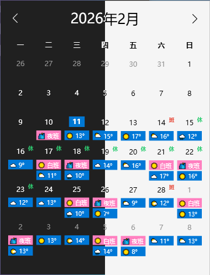

# Mini Calendar - 托盘日历应用

一个基于 .NET 10 和 WPF 的 Windows 托盘日历应用程序，支持显示中国节假日调休和订阅 ICS 日历。



## 功能特性

### 🎯 核心功能
- **系统托盘图标**：在系统托盘区域显示日历图标
- **中国节假日**：自带中国节假日调休显示
- **云端 ICS 支持**：可订阅多个 HTTPS 协议的 ICS 文件源
- **自动刷新**：支持定时刷新 ICS 文件，可自定义刷新间隔
- **事件显示**：在日历中显示当天所有事件
- **悬停详情**：鼠标悬停显示完整事件信息

### ⚙️ 配置管理
- **ICS 源管理**：添加、编辑、删除多个 ICS 源
- **个性化设置**：自定义颜色、刷新间隔、启用状态
- **本地存储**：配置数据保存在本地 JSON 文件
- **立即刷新**：手动触发日历数据更新

### 🎨 界面特性
- **现代设计**：采用 Windows 10 设计风格
- **透明背景**：支持磨砂透明效果
- **智能定位**：窗口自动对齐托盘图标，支持边缘自适应
- **深色主题**：支持深色模式显示

## 技术栈

- **.NET 10**：最新的 .NET 平台
- **WPF**：Windows Presentation Foundation
- **C#**：主要编程语言
- **Ical.Net**：ICS 文件解析库
- **Newtonsoft.Json**：JSON 序列化
- **Hardcodet.NotifyIcon.Wpf**：系统托盘图标支持

## 项目结构

```
MiniCalendar/
├── Models/                    # 数据模型
│   ├── IcsSource.cs          # ICS 源配置模型
│   ├── CalendarEvent.cs      # 日历事件模型
│   ├── AppSettings.cs        # 应用程序设置模型
├── Services/                  # 业务服务
│   ├── SettingsService.cs      # 配置管理服务
│   ├── IcsService.cs          # ICS 文件解析服务
│   ├── TrayIconHelper.cs       # 托盘图标位置辅助类
├── Controls/                  # 自定义控件
│   ├── CalendarControl.xaml  # 日历控件
│   ├── SettingsWindow.xaml   # 设置窗口
│   ├── EventDetailsWindow.xaml # 事件详情窗口
│   └── IcsSourceEditWindow.xaml # ICS 源编辑窗口
├── Themes/                    # 主题样式
│   └── Generic.xaml          # 通用样式定义
├── App.xaml                  # 应用程序入口
├── MainWindow.xaml           # 主窗口
└── MiniCalendar.csproj       # 项目文件
```

## 安装和运行

### 环境要求
- Windows 10 或 Windows 11
- .NET 10 Runtime
- Visual Studio 2022 或更高版本（开发）

### 编译运行
1. 克隆项目到本地
2. 使用 Visual Studio 打开 `MiniCalendar.csproj`
3. 还原 NuGet 包
4. 编译并运行项目

### 发布
```bash
dotnet publish -c Release -r win-x64 -p:PublishSingleFile=true -p:IncludeNativeLibrariesForSelfExtract=true -p:EnableCompressionInSingleFile=true --self-contained
```

## 注意事项

- 确保日历 URL 使用 webcal/https 协议
- 合理设置刷新间隔，避免过于频繁的请求
- 应用程序需要网络连接才能获取云端 ICS 文件
- 配置数据存储在 `%LocalAppData%\MiniCalendar\settings.json`

## 许可证

MIT License - 详见 LICENSE 文件